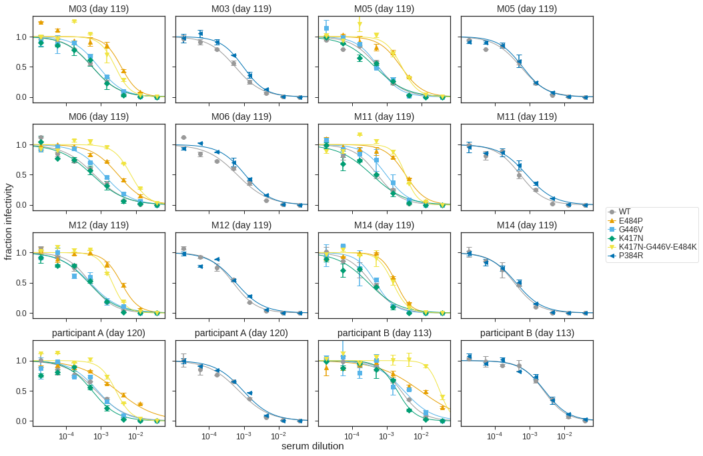

# Neutralization assays of Moderna and convalescent (HAARVI) sera versus WT and mutant spike-pseudotyped lentiviruses

Andrea, Lauren, and I set up these neuts.

The data that are analyzed in this notebook were pre-processed by Kate's `excel_to_fracinfect` script. 

### Import modules


```python
import collections
import itertools
import math
import os
import re
import string
import warnings
import xml.etree.ElementTree as ElementTree

from IPython.display import display, HTML
from IPython.display import display, SVG
from matplotlib.backends.backend_pdf import PdfPages
import matplotlib as mpl
import matplotlib.pyplot as plt

import natsort
import numpy as np
import pandas as pd
from plotnine import *

import neutcurve
from neutcurve.colorschemes import CBMARKERS, CBPALETTE
import seaborn

import yaml
```


```python
warnings.simplefilter('ignore')
```


```python
plt.style.use('seaborn-white')
theme_set(theme_seaborn(style='white', context='talk', font='FreeSans', font_scale=1))
```

### Create results directory


```python
resultsdir='results/mutant_neuts_results/'
os.makedirs(resultsdir, exist_ok=True)
```

Read config file


```python
with open('mutant_neuts_config.yaml') as f:
    config = yaml.safe_load(f)

with open('../config.yaml') as f:
    global_config = yaml.safe_load(f)
```

### Read in data
* Concatenate the `frac_infectivity` files.
* Remove samples specified in config file. 
* Also remove specified sample / dilution combinations where something has clearly gone wrong experimentally (like forgetting to add virus or cells). 
* Replace `serum` with `display_name`


```python
frac_infect = pd.DataFrame() # create empty data frame

if config['neut_samples_ignore']:
    neut_samples_ignore = config['neut_samples_ignore']

for f in config['neut_input_files'].keys():
    df = (pd.read_csv(f, index_col=0).assign(date=config['neut_input_files'][f]))
    frac_infect = frac_infect.append(df).reset_index(drop=True)

print(f"Length before dropping anything = {len(frac_infect.index)}")
    
frac_infect = (frac_infect
        .reset_index(drop=True)
       )

print(f"Length after dropping neut_samples_ignore = {len(frac_infect.index)}")

# below deals with samples / dates/ dilutions to ignore, which are currently none

for virus in config['neut_ignore_viruses']:
    dat = config['neut_ignore_viruses'][virus]
    l = len((frac_infect[(frac_infect['virus'] == virus) & (frac_infect['date'] == dat)]))
    print(f"Dropping {l} rows")
    frac_infect = frac_infect.drop(frac_infect[((frac_infect['virus'] == virus) & (frac_infect['date'] == dat))].index)
    print(f"Length after dropping {virus}: {dat} = {len(frac_infect.index)}")


# change names .assign(wildtype=lambda x: x['site'].map(site_to_wt),    
print(config['validated_samples'])
    
frac_infect = frac_infect.assign(serum=lambda x: x['serum'].map(config['validated_samples']))
frac_infect.head(2)
```

    Length before dropping anything = 1984
    Length after dropping neut_samples_ignore = 1984
    Dropping 128 rows
    Length after dropping E484K: 210308 = 1856
    {'M06-day-119': 'M06 (day 119)', 'M11-day-119': 'M11 (day 119)', 'M05-day-119': 'M05 (day 119)', 'M03-day-119': 'M03 (day 119)', 'M12-day-119': 'M12 (day 119)', 'M14-day-119': 'M14 (day 119)', '24C_d104': 'subject C (day 104)', '22C_d104': 'subject E (day 104)', '23C_d102': 'subject I (day 102)', '1C_d113': 'subject B (day 113)', '23_d120': 'subject A (day 120)', '25_d94': 'subject G (day 94)'}


<div>
<style scoped>
    .dataframe tbody tr th:only-of-type {
        vertical-align: middle;
    }

    .dataframe tbody tr th {
        vertical-align: top;
    }

    .dataframe thead th {
        text-align: right;
    }
</style>
<table border="1" class="dataframe">
  <thead>
    <tr style="text-align: right;">
      <th></th>
      <th>serum</th>
      <th>virus</th>
      <th>replicate</th>
      <th>concentration</th>
      <th>fraction infectivity</th>
      <th>date</th>
    </tr>
  </thead>
  <tbody>
    <tr>
      <th>0</th>
      <td>M03 (day 119)</td>
      <td>WT</td>
      <td>1</td>
      <td>0.04000</td>
      <td>-0.000007</td>
      <td>210308</td>
    </tr>
    <tr>
      <th>1</th>
      <td>M03 (day 119)</td>
      <td>WT</td>
      <td>1</td>
      <td>0.01333</td>
      <td>-0.000007</td>
      <td>210308</td>
    </tr>
  </tbody>
</table>
</div>


### Use `neutcurve` to fit Hill curves to data.
Get IC50 and calculate NT50. 
Determine if IC50 is bound.


```python
for d in frac_infect['date'].unique():
    print(d)
```

    210308
    210312


```python
fitparams = pd.DataFrame(columns=['serum', 'virus', 'ic50', 'NT50', 'ic50_bound', 'date'])

for d in frac_infect['date'].unique():
    fits = neutcurve.CurveFits(frac_infect.query('date==@d'))

    fp = (
        fits.fitParams()
        .assign(NT50=lambda x: 1/x['ic50'],
                date=d
               )
        .replace({'WT':'wildtype'})
        # get columns of interest
        [['serum', 'virus', 'ic50', 'NT50', 'ic50_bound', 'date']] 
        )

    # couldn't get lambda / conditional statement to work with assign, so try it here:
    fp['ic50_is_bound'] = fp['ic50_bound'].apply(lambda x: True if x!='interpolated' else False)
    fitparams=fitparams.append(fp, ignore_index=True)

fitparams.head()
```


<div>
<style scoped>
    .dataframe tbody tr th:only-of-type {
        vertical-align: middle;
    }

    .dataframe tbody tr th {
        vertical-align: top;
    }

    .dataframe thead th {
        text-align: right;
    }
</style>
<table border="1" class="dataframe">
  <thead>
    <tr style="text-align: right;">
      <th></th>
      <th>serum</th>
      <th>virus</th>
      <th>ic50</th>
      <th>NT50</th>
      <th>ic50_bound</th>
      <th>date</th>
      <th>ic50_is_bound</th>
    </tr>
  </thead>
  <tbody>
    <tr>
      <th>0</th>
      <td>M03 (day 119)</td>
      <td>wildtype</td>
      <td>0.000561</td>
      <td>1783.440839</td>
      <td>interpolated</td>
      <td>210308</td>
      <td>False</td>
    </tr>
    <tr>
      <th>1</th>
      <td>M03 (day 119)</td>
      <td>E484P</td>
      <td>0.003804</td>
      <td>262.872902</td>
      <td>interpolated</td>
      <td>210308</td>
      <td>False</td>
    </tr>
    <tr>
      <th>2</th>
      <td>M03 (day 119)</td>
      <td>G446V</td>
      <td>0.000847</td>
      <td>1180.832242</td>
      <td>interpolated</td>
      <td>210308</td>
      <td>False</td>
    </tr>
    <tr>
      <th>3</th>
      <td>M03 (day 119)</td>
      <td>K417N</td>
      <td>0.000555</td>
      <td>1801.081391</td>
      <td>interpolated</td>
      <td>210308</td>
      <td>False</td>
    </tr>
    <tr>
      <th>4</th>
      <td>M03 (day 119)</td>
      <td>K417N-G446V-E484K</td>
      <td>0.002573</td>
      <td>388.718850</td>
      <td>interpolated</td>
      <td>210308</td>
      <td>False</td>
    </tr>
  </tbody>
</table>
</div>


### Calculate fold change for each mutant relative to wild type.


```python
fc = (
    fitparams
#     .query('virus != "wildtype"')
#     .rename(columns={'virus': 'mutant'})
    .merge(fitparams.query('virus == "wildtype"')
                    [['serum', 'ic50', 'date']]
                    .rename(columns={'ic50': 'wildtype_ic50'}),
           on=['serum', 'date'],
           how='left',
           validate='many_to_one',
           )
    .assign(fold_change=lambda x: x['ic50'] / x['wildtype_ic50'],
            log2_fold_change=lambda x: np.log(x['fold_change']) / np.log(2),
            sample_type=lambda x: x['serum'].map(config['sample_types'])
           )
    )

fc.to_csv(f'{resultsdir}/fitparams.csv', index=False)
fc.head(3)
```


<div>
<style scoped>
    .dataframe tbody tr th:only-of-type {
        vertical-align: middle;
    }

    .dataframe tbody tr th {
        vertical-align: top;
    }

    .dataframe thead th {
        text-align: right;
    }
</style>
<table border="1" class="dataframe">
  <thead>
    <tr style="text-align: right;">
      <th></th>
      <th>serum</th>
      <th>virus</th>
      <th>ic50</th>
      <th>NT50</th>
      <th>ic50_bound</th>
      <th>date</th>
      <th>ic50_is_bound</th>
      <th>wildtype_ic50</th>
      <th>fold_change</th>
      <th>log2_fold_change</th>
      <th>sample_type</th>
    </tr>
  </thead>
  <tbody>
    <tr>
      <th>0</th>
      <td>M03 (day 119)</td>
      <td>wildtype</td>
      <td>0.000561</td>
      <td>1783.440839</td>
      <td>interpolated</td>
      <td>210308</td>
      <td>False</td>
      <td>0.000561</td>
      <td>1.000000</td>
      <td>0.000000</td>
      <td>vaccine</td>
    </tr>
    <tr>
      <th>1</th>
      <td>M03 (day 119)</td>
      <td>E484P</td>
      <td>0.003804</td>
      <td>262.872902</td>
      <td>interpolated</td>
      <td>210308</td>
      <td>False</td>
      <td>0.000561</td>
      <td>6.784423</td>
      <td>2.762226</td>
      <td>vaccine</td>
    </tr>
    <tr>
      <th>2</th>
      <td>M03 (day 119)</td>
      <td>G446V</td>
      <td>0.000847</td>
      <td>1180.832242</td>
      <td>interpolated</td>
      <td>210308</td>
      <td>False</td>
      <td>0.000561</td>
      <td>1.510325</td>
      <td>0.594859</td>
      <td>vaccine</td>
    </tr>
  </tbody>
</table>
</div>


### Plot the raw neutralization curves


```python
for d in frac_infect['date'].unique():
    fits = neutcurve.CurveFits(frac_infect.query('date==@d'))
    xlab= 'serum dilution'
    name= 'sera'

    fig, axes = fits.plotSera(xlabel=xlab,)

    plotfile = f'./{resultsdir}/{d}_mutant_neuts.pdf'
    print(f"Saving to {plotfile}")
    fig.savefig(plotfile, bbox_inches='tight')
```

    Saving to ./results/mutant_neuts_results//210308_mutant_neuts.pdf
    Saving to ./results/mutant_neuts_results//210312_mutant_neuts.pdf


    

    


Plot the triple mutant and composite single mutants for one convalescent and one vaccine sample, for main-text figure.

I think M11 and subject E


```python
# key sera of interest
sera_to_plot = ['M06 (day 119)', 'M11 (day 119)',
                'subject C (day 104)', 'subject E (day 104)']
# key viruses of interest
viruses_to_plot = ['WT',
                   'K417N',
                   'G446V',
                   'E484K',
                   'K417N-G446V-E484K'
                   ]

# Now plot by sera **not** including assay date; when multiple measurements for
# an assay date just take the first one.
df = (frac_infect
      .query('(serum in @sera_to_plot) and (virus in @viruses_to_plot)')
      .assign(first_assay_date=lambda x: x.groupby(['serum', 'virus'])['date'].transform('first'))
      .query('date == first_assay_date')
      .replace({'WT':'wildtype'})
      )

df.head()
fits = neutcurve.CurveFits(df,
                           serum_col='serum')
fig, _ = fits.plotSera(xlabel='serum dilution',
                       viruses=["wildtype" if x=="WT" else x for x in viruses_to_plot],
                       ncol=2,
                       heightscale=1,
                       widthscale=1,
                       max_viruses_per_subplot=len(viruses_to_plot),
                       sharex=True,
                       )
display(fig)
plotfile = os.path.join(resultsdir, 'main_fig_neut.pdf')
print(f"Saving to {plotfile}")
fig.savefig(plotfile, bbox_inches='tight')
plt.close(fig)
```

## Get depletion NT50s and fold-change


```python
haarvi_samples = config["validated_samples"].values()
haarvi_depletions = (pd.read_csv(config['haarvi_depletions'])
                     [['serum','fold_change', 'NT50_post', 'post-depletion_ic50', 'post_ic50_bound']]
                     .drop_duplicates()
                     .rename(columns={'NT50_post':'NT50', 
                                      'post-depletion_ic50':'ic50', 
                                      'post_ic50_bound':'ic50_is_bound'})
                     .assign(log2_fold_change=lambda x: np.log(x['fold_change']) / np.log(2),
                             virus='RBD antibodies depleted'
                            )
                     .query('serum in @haarvi_samples')
                    )

haarvi_depletions_wt = (pd.read_csv(config['haarvi_depletions'])
                     [['serum','fold_change', 'NT50_pre', 'pre-depletion_ic50']]
                     .drop_duplicates()
                     .rename(columns={'NT50_pre':'NT50', 
                                      'pre-depletion_ic50':'ic50', 
                                      })
                     .assign(fold_change=1,
                             log2_fold_change=lambda x: np.log(x['fold_change']) / np.log(2),
                             virus='wildtype'
                            )
                     .query('serum in @haarvi_samples')
                    )

moderna_depletions = (pd.read_csv(config['moderna_depletions'])
                      [['serum','fold_change', 'NT50_post', 'post-depletion_ic50', 'post_ic50_bound']]
                      .drop_duplicates()
                      .rename(columns={'NT50_post':'NT50', 
                                      'post-depletion_ic50':'ic50', 
                                      'post_ic50_bound':'ic50_is_bound'})
                      .assign(log2_fold_change=lambda x: np.log(x['fold_change']) / np.log(2),
                              serum=lambda x: x['serum'].map(config['validated_samples']),
                              virus='RBD antibodies depleted'
                             )
                      .dropna(subset=['serum'])
                     )

moderna_depletions_wt = (pd.read_csv(config['moderna_depletions'])
                      [['serum','fold_change', 'NT50_pre', 'pre-depletion_ic50']]
                      .drop_duplicates()
                      .rename(columns={'NT50_pre':'NT50', 
                                      'pre-depletion_ic50':'ic50', 
                                      })
                      .assign(fold_change=1,
                              log2_fold_change=lambda x: np.log(x['fold_change']) / np.log(2),
                              serum=lambda x: x['serum'].map(config['validated_samples']),
                              virus='wildtype'
                             )
                      .dropna(subset=['serum'])
                     )

depletion_df = (pd.concat(
    [moderna_depletions, haarvi_depletions, moderna_depletions_wt, haarvi_depletions_wt],
    axis=0,
    ignore_index=True)
                .fillna(False)
               )
display(HTML(depletion_df.to_html(index=False)))
```

## Read in escape fractions


```python
escape_fracs_file = os.path.join('..', global_config['escape_fracs'])
escape_fracs = pd.read_csv(escape_fracs_file).query('library == "average"')

escape_metrics = [global_config['site_metric'], global_config['mut_metric']]

display(HTML(escape_fracs.head().to_html(index=False)))
```


```python
print(config['map_conditions'])
```


```python
samples = config['map_conditions'].values()
escape_fracs_df = (escape_fracs
                   .replace(config['map_conditions'])
                   .query('selection in @samples')
                   [['selection', 'label_site', 'wildtype', 'mutation', global_config['site_metric'], global_config['mut_metric']]]
                   .rename(columns={'selection':'serum', 
                                    'label_site': 'site', 
                                    global_config['mut_metric']:'mutation escape',
                                    global_config['site_metric']:'site total escape',
                                   }
                          )
                   .assign(virus=lambda x: x['wildtype'] + x['site'].astype(str) + x['mutation'],
                           site_label=lambda x: x['wildtype'] + x['site'].astype(str),
                           site=lambda x: x['site'].astype(str)
                          )
                   .drop(columns=['wildtype', 'mutation', 'site_label', 'site'])
                  )

display(HTML(escape_fracs_df.head().to_html(index=False)))
```

## Make plot showing NT50 for each genotype (wildtype or mutant) for each serum.
This is actually an important thing we should probably add to the paper. 
Even though the NT50s decrease by ~10-fold or more for some sera against some mutants, the absolute NT50 remaining might still be quite potent. 
It would be nice to have this clearly shown.


```python
muts_depletions = (pd.concat([depletion_df, fc], axis=0, ignore_index=True)
                   .assign(sample_type=lambda x: x['serum'].map(config['sample_types']))
                   .merge(escape_fracs_df,
                          how='left', 
                          on=['serum', 'virus']
                         )
                   .assign(virus=lambda x: pd.Categorical(x['virus'], categories=config['viruses'].keys(), ordered=True),
                           epitope=lambda x: x['virus'].map(config['viruses']),
                          )
               )

display(HTML(muts_depletions.tail().to_html(index=False)))
```


```python
muts_depletions['virus'].drop_duplicates()
```


```python
serum_order = list(config['sample_types'].keys())
```


```python
p = (ggplot((muts_depletions.assign(serum=lambda x: pd.Categorical(x['serum'],ordered=True,categories=serum_order)))) +
     aes('virus', 'NT50', shape='ic50_is_bound', fill='site total escape') +
     geom_point(size=2.5, alpha=1) +
     scale_x_discrete(name='') +
     scale_y_log10(name='neutralization titer (NT50)', expand=(0.1,0.1)) +
     facet_wrap('~serum', ncol=6) +
     theme_classic() +
     theme(axis_text_x=element_text(angle=90),
           figure_size=(0.2 * muts_depletions['virus'].nunique()*muts_depletions['serum'].nunique()/2, 4),
           strip_margin_y=0.35,
           strip_background_x=element_blank(),
           ) +
         geom_hline(yintercept=25, linetype='dashed', size=1,
                    alpha=0.6, color=CBPALETTE[0]) +
     scale_fill_gradient(low='white', high='#BD0026') +
     scale_shape_manual(values=['o','^'], name='below limit\nof detection')
#      scale_fill_manual(values=['gray', 'white'],name='below limit\nof detection')
#          +scale_color_manual(values=['gray', '#D55E00'],name='E484 mutant')
     )

_ = p.draw()

plotfile = f'{resultsdir}/all_neuts_NT50.pdf'
print(f"Saving to {plotfile}")
p.save(plotfile, verbose=False)
```

Now plot IC50 instead


```python
p = (ggplot((muts_depletions.assign(serum=lambda x: pd.Categorical(x['serum'],ordered=True,categories=serum_order)))) +
     aes('virus', 'ic50', shape='ic50_is_bound', fill='site total escape') +
     geom_point(size=2.5, alpha=1) +
     scale_x_discrete(name='') +
     scale_y_log10(name='inhibitory concentration 50% (IC50)', expand=(0.1,0.1)) +
     facet_wrap('~serum', ncol=6) +
     theme_classic() +
     theme(axis_text_x=element_text(angle=90),
           figure_size=(0.2 * muts_depletions['virus'].nunique()*muts_depletions['serum'].nunique()/2, 4),
           strip_margin_y=0.35,
           strip_background_x=element_blank(),
           ) +
     scale_fill_gradient(low='white', high='#BD0026') +
     scale_shape_manual(values=['o','^'], name='upper limit')
     )

_ = p.draw()

plotfile = f'{resultsdir}/all_neuts_IC50.pdf'
print(f"Saving to {plotfile}")
p.save(plotfile, verbose=False)
```


```python
p = (ggplot((muts_depletions.assign(serum=lambda x: pd.Categorical(x['serum'],ordered=True,categories=serum_order)))) +
     aes('virus', 'ic50', shape='ic50_is_bound', fill='epitope') +
     geom_point(size=2.5, alpha=0.75) +
     scale_x_discrete(name='') +
     scale_y_log10(name='inhibitory concentration 50% (IC50)', expand=(0.1,0.1)) +
     facet_wrap('~serum', ncol=6) +
     theme_classic() +
     theme(axis_text_x=element_text(angle=90),
           figure_size=(0.2 * muts_depletions['virus'].nunique()*muts_depletions['serum'].nunique()/2, 4),
           strip_margin_y=0.35,
           strip_background_x=element_blank(),
           ) +
     scale_fill_manual(values=config['epitope_colors'], name=' ') +
     scale_shape_manual(values=['o','^'], name='upper limit')
     )

_ = p.draw()

plotfile = f'{resultsdir}/all_neuts_IC50_nocolor.pdf'
print(f"Saving to {plotfile}")
p.save(plotfile, verbose=False)
```

### Plot fold-change IC50 relative to wild type for each mutant.
You could also imagine drawing a dashed line with the fold-change with RBD depletion, which sets an upper limit on what we would expect to see (the max drop in NT50 we could see due to anything RBD-related). 

To do this you would need to:
* Read in foldchange IC50 due to RBD depletion (specify path in config file)
* Merge with mutant `foldchange` dataframe
* Add `geom_hline` with depletion foldchange


```python
muts_depletions = (muts_depletions
                   .assign(serum=lambda x: pd.Categorical(x['serum'],ordered=True,categories=serum_order))
                  )
    
p = (ggplot(muts_depletions
            .query("virus != 'RBD antibodies depleted' & virus != 'wildtype'")
            ) +
     aes('virus', 'fold_change', fill='site total escape', shape='ic50_is_bound',
        ) +
     geom_point(size=2.5, alpha=1) +
     scale_y_log10(name='fold decrease in neutralization') +
     facet_wrap('~serum', ncol=6) +
     theme_classic() +
     theme(axis_text_x=element_text(angle=90),
           axis_title_x=element_blank(),
           strip_margin_y=0.35,
           strip_background_x=element_blank(),
           figure_size=(0.2 * (muts_depletions['virus'].nunique()-1)*muts_depletions['serum'].nunique()/2, 4),
           ) +
     geom_hline(yintercept=1, linetype='dashed', size=1,
                alpha=0.6, color=CBPALETTE[0]) +
     geom_hline(data=muts_depletions.query('virus=="RBD antibodies depleted"'),
                mapping=aes(yintercept='fold_change'),
                color=CBPALETTE[1],
                alpha=0.7,
                size=1,
                linetype='dotted',
               ) +
     scale_fill_gradient(low='white', high='#BD0026') +
     scale_shape_manual(values=['o','^'], name='upper limit')
#      scale_color_manual(values=CBPALETTE[1:],
#                         name='upper limit') +
#      scale_fill_manual(values=['gray', 'white'],name='upper limit')
     )

_ = p.draw()

plotfile = f'{resultsdir}/fold_change_IC50.pdf'
print(f"Saving to {plotfile}")
p.save(plotfile, verbose=False)
```


```python
muts_depletions = (muts_depletions
                   .assign(serum=lambda x: pd.Categorical(x['serum'],ordered=True,categories=serum_order))
                  )
    
p = (ggplot(muts_depletions
            .query("virus != 'RBD antibodies depleted' & virus != 'wildtype'")
            ) +
     aes('virus', 'fold_change', shape='ic50_is_bound', fill='epitope'
        ) +
     geom_point(size=2.5, alpha=1, ) + #fill='#999999'
     scale_y_log10(name='fold decrease in neutralization') +
     facet_wrap('~serum', ncol=6, ) + #scales='free_x'
     theme_classic() +
     theme(axis_text_x=element_text(angle=90),
           axis_title_x=element_blank(),
           strip_margin_y=0.35,
           strip_background_x=element_blank(),
#            subplots_adjust={'hspace':1},
           figure_size=(0.2 * (muts_depletions['virus'].nunique()-1)*muts_depletions['serum'].nunique()/2, 4),
           ) +
     geom_hline(yintercept=1, linetype='dashed', size=1,
                alpha=0.6, color=CBPALETTE[0]) +
     geom_hline(data=muts_depletions.query('virus=="RBD antibodies depleted"'),
                mapping=aes(yintercept='fold_change'),
                color=CBPALETTE[1],
                alpha=0.7,
                size=1,
                linetype='dotted',
               ) +
     scale_fill_manual(values=config['epitope_colors'], name=' ') +
     scale_shape_manual(values=['o','^'], name='upper limit')
     )

_ = p.draw()

plotfile = f'{resultsdir}/fold_change_IC50_nocolor.pdf'
print(f"Saving to {plotfile}")
p.save(plotfile, verbose=False)
```


```python
p = (ggplot(muts_depletions
            .query("virus != 'wildtype' & virus != 'RBD antibodies depleted'")
            .assign(sample_type=lambda x: pd.Categorical(x['sample_type'],ordered=True,categories=['vaccine', 'convalescent']))
             .replace({'K417N-G446V-E484K':'K417N\nG446V\nE484K'})
             .assign(virus=lambda x: pd.Categorical(x['virus'],ordered=True,categories=list(config['viruses'].keys())+['K417N\nG446V\nE484K']))
            ) +
     aes('virus', 'fold_change', fill='sample_type', color='sample_type', shape='ic50_is_bound',) + 
     geom_boxplot(aes(), #color='sample_type'
                  width=0.4,
                  position=position_dodge(width=0.5),
                  outlier_shape='',
                 ) +
     geom_jitter(position=position_dodge(width=0.5), size=2.5, alpha=0.5) +
     scale_y_log10(name='fold-decrease in neutralization') +
     theme_classic() +
     theme(axis_title_x=element_blank(),
           axis_title_y=element_text(size=9),
           legend_title=element_blank(),
#            legend_title=element_text(size=10),
           figure_size=(0.75 * (muts_depletions['virus'].nunique()-2), 2.5),
           ) +
     geom_hline(yintercept=1, linetype='dashed', size=1,
                alpha=0.6, color=CBPALETTE[0]) +
     scale_fill_manual(values=['#CC6677', '#332288'])+
     scale_color_manual(values=['#CC6677', '#332288']) +
     scale_shape_manual(values=['o','^'], name='upper limit')
     )

_ = p.draw()

plotfile = f'{resultsdir}/fold_change_IC50_dodged.pdf'
print(f"Saving to {plotfile}")
p.save(plotfile, verbose=False)
```


```python
median_df=(muts_depletions
 .groupby(['virus', 'sample_type'], as_index=False)
 .aggregate(ic50=pd.NamedAgg(column='ic50', aggfunc='median'),
            fold_change=pd.NamedAgg(column='fold_change', aggfunc='median'),
           )
           .reset_index()
           .assign(sample_type=lambda x: pd.Categorical(x['sample_type'],
                                                        ordered=True,
                                                        categories=['vaccine', 'convalescent'])
                  )
           .replace({'K417N-G446V-E484K':'K417N\nG446V\nE484K',
                     'RBD antibodies depleted':'all RBD\nantibodies\ndepleted'
                    }
                   )
           .assign(virus=lambda x: pd.Categorical(x['virus'],
                                                  ordered=True,
                                                  categories=list(config['viruses'].keys())+['K417N\nG446V\nE484K','all RBD\nantibodies\ndepleted']))
)
```


```python
p = (ggplot(muts_depletions
#             .query("virus != 'wildtype' & virus != 'RBD antibodies depleted'")
            .assign(sample_type=lambda x: pd.Categorical(x['sample_type'],ordered=True,categories=['vaccine', 'convalescent']))
             .replace({'K417N-G446V-E484K':'K417N\nG446V\nE484K',
                       'RBD antibodies depleted':'all RBD\nantibodies\ndepleted'
                      }
                     )
             .assign(virus=lambda x: pd.Categorical(x['virus'],ordered=True,categories=list(config['viruses'].keys())+['K417N\nG446V\nE484K','all RBD\nantibodies\ndepleted']))
            ) +
     aes('virus', 'fold_change', fill='sample_type', color='sample_type', ) + #shape='ic50_is_bound'
     geom_crossbar(data=(median_df),
                   mapping=aes(x='virus', ymin='fold_change', ymax='fold_change'),
                   position=position_dodge(width=0.5),
                  ) +
     geom_jitter(position=position_dodge(width=0.5), size=2.5, alpha=0.5) +
     scale_y_log10(name='fold-decrease in neutralization') +
     theme_classic() +
     theme(axis_title_x=element_blank(),
           axis_title_y=element_text(size=9),
           legend_title=element_blank(),
#            legend_title=element_text(size=10),
           figure_size=(0.8 * (muts_depletions['virus'].nunique()), 2.5),
           ) +
     geom_hline(yintercept=1, linetype='dashed', size=1,
                alpha=0.6, color=CBPALETTE[0]) +
     scale_fill_manual(values=['#44AA99', '#332288'])+
     scale_color_manual(values=['#44AA99', '#332288']) #+
#      scale_shape_manual(values=['o','^'], name='upper limit')
     )

_ = p.draw()

plotfile = f'{resultsdir}/fold_change_IC50_dodged_wt.pdf'
print(f"Saving to {plotfile}")
p.save(plotfile, verbose=False)
```


```python
p = (ggplot(muts_depletions
#             .query("virus != 'wildtype' & virus != 'RBD antibodies depleted'")
            .assign(sample_type=lambda x: pd.Categorical(x['sample_type'],ordered=True,categories=['vaccine', 'convalescent']))
             .replace({'K417N-G446V-E484K':'K417N\nG446V\nE484K',
                       'RBD antibodies depleted':'all RBD\nantibodies\ndepleted'
                      }
                     )
             .assign(virus=lambda x: pd.Categorical(x['virus'],ordered=True,categories=list(config['viruses'].keys())+['K417N\nG446V\nE484K','all RBD\nantibodies\ndepleted']))
            ) +
     aes('virus', 'ic50', fill='sample_type', color='sample_type', ) + # shape='ic50_is_bound'
     geom_jitter(aes(fill='sample_type', color='sample_type'), position=position_dodge(width=0.5), size=2.5, alpha=0.5) +
     geom_crossbar(data=(median_df),
                   mapping=aes(x='virus', ymin='ic50', ymax='ic50'),
                   position=position_dodge(width=0.5),
                  ) +
     scale_y_log10(name='inhibitory concentration 50%\n(IC50)') +
#      geom_hline(yintercept=0.04, linetype='dotted', size=1,
#                 alpha=0.6, color='#CCBB44') +
     theme_classic() +
     theme(axis_title_x=element_blank(),
           axis_title_y=element_text(size=9),
           legend_title=element_blank(),
           figure_size=(0.8 * (muts_depletions['virus'].nunique()), 2.5),
           ) +
     scale_fill_manual(values=['#44AA99', '#332288'])+
     scale_color_manual(values=['#44AA99', '#332288']) #+
#      scale_shape_manual(values=['o','^'], name='upper limit')
     )

_ = p.draw()

plotfile = f'{resultsdir}/IC50_dodged.pdf'
print(f"Saving to {plotfile}")
p.save(plotfile, verbose=False)
```

Show the triple and its composite mutations only


```python
triples = ['K417N', 'G446V', 'E484K', 'K417N-G446V-E484K', 'K417N\nG446V\nE484K']

p = (ggplot(muts_depletions
            .query("virus in @triples")
            .assign(sample_type=lambda x: pd.Categorical(x['sample_type'],ordered=True,categories=['vaccine', 'convalescent']))
             .replace({'K417N-G446V-E484K':'K417N\nG446V\nE484K',
                       'RBD antibodies depleted':'all RBD\nantibodies\ndepleted'
                      }
                     )
             .assign(virus=lambda x: pd.Categorical(x['virus'],ordered=True,categories=list(config['viruses'].keys())+['K417N\nG446V\nE484K','all RBD\nantibodies\ndepleted']))
            ) +
     aes('virus', 'fold_change', fill='sample_type', color='sample_type', ) + #shape='ic50_is_bound'
     geom_crossbar(data=(median_df.query("virus in @triples")),
                   mapping=aes(x='virus', ymin='fold_change', ymax='fold_change'),
                   position=position_dodge(width=0.5),
                  ) +
     geom_jitter(position=position_dodge(width=0.5), size=2.5, alpha=0.5) +
     scale_y_log10(name='fold-decrease in neutralization') +
     theme_classic() +
     theme(axis_title_x=element_blank(),
           axis_title_y=element_text(size=9),
           legend_title=element_blank(),
#            legend_title=element_text(size=10),
           figure_size=(0.8 * 4, 2.5),
           ) +
     geom_hline(yintercept=1, linetype='dashed', size=1,
                alpha=0.6, color=CBPALETTE[0]) +
     scale_fill_manual(values=['#44AA99', '#332288'])+
     scale_color_manual(values=['#44AA99', '#332288']) #+
#      scale_shape_manual(values=['o','^'], name='upper limit')
     )

_ = p.draw()

plotfile = f'{resultsdir}/fold_change_IC50_triple.pdf'
print(f"Saving to {plotfile}")
p.save(plotfile, verbose=False)
```

Plot viral entry titers as RLU/uL


```python
entry_titers = (pd.read_csv(config['titer_input_file'])
                .assign(virus=lambda x: pd.Categorical(x['virus'], 
                                                       categories=config['viruses'].keys(), 
                                                       ordered=True),
                        epitope=lambda x: x['virus'].map(config['viruses']),
                       )
                .rename(columns={'RLU per uL':'RLU_per_uL'})
               )

p = (ggplot(entry_titers, 
            aes(x='virus', y='RLU_per_uL', fill='epitope')
           ) +
     geom_point(size=2,alpha=0.75, position=position_jitterdodge(jitter_width=0.2, jitter_height=0, dodge_width=0.2, random_state=123)) +
     geom_crossbar(data=(entry_titers
                         .groupby(['virus'], as_index=False)
                         .aggregate(RLU_per_uL=pd.NamedAgg(column='RLU_per_uL', aggfunc='median'))),
                   mapping=aes(x='virus', y='RLU_per_uL', ymin='RLU_per_uL', ymax='RLU_per_uL'),
                   inherit_aes=False,
           )+
     theme_classic() +
     theme(axis_text_x=element_text(angle=90, vjust=1, hjust=0.5),
           figure_size=(2.5,2),
           axis_title_x=element_blank(),
          ) +
     scale_y_log10(limits=[100,1.1e6]) +
     ylab('relative luciferase units\nper uL')+
     labs(title='pseudovirus entry titers') +
     scale_fill_manual(values=config['epitope_colors'], name=' ')
    )

_ = p.draw()

plotfile = f'{resultsdir}/entry_titers_techreps.pdf'
print(f"Saving to {plotfile}")
p.save(plotfile, verbose=False)
```


```python
for metric in ['mean', 'median']:
    p = (ggplot((entry_titers
                 .groupby(['virus'], as_index=False)
                 .aggregate(RLU_per_uL=pd.NamedAgg(column='RLU_per_uL', aggfunc=metric))
                 .merge(entry_titers[['virus','epitope']].drop_duplicates())
                ), 
                aes(x='virus', y='RLU_per_uL', fill='epitope')
               ) +
         geom_point(size=2.5, alpha=0.75)+
         theme_classic() +
         theme(axis_text_x=element_text(angle=90, vjust=1, hjust=0.5),
               figure_size=(2.5,2),
               axis_title_x=element_blank(),
              ) +
         scale_y_log10(limits=[100,1.1e6]) +
         ylab('relative luciferase units\nper uL')+
         labs(title='pseudovirus entry titers') +
         scale_fill_manual(values=config['epitope_colors'], name=' ')
        )

    _ = p.draw()
    
    plotfile = f'{resultsdir}/entry_titers_{metric}.pdf'
    print(f"Saving to {plotfile}")
    p.save(plotfile, verbose=False)
```


```python
!jupyter nbconvert mutant_neuts.ipynb --to markdown
```


```python

```
