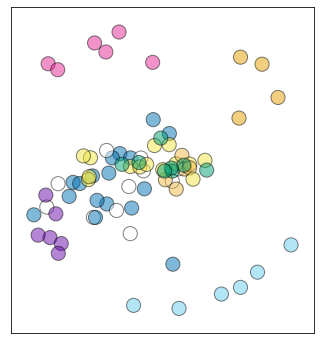

# Multidimensional scaling of antibody escape profiles
This Python Jupyter notebook performs multi-dimensional scaling of escape profiles to project the antibodies into two dimensions based on similarity of their escape profiles.

## Set up analysis
Import Python modules:


```python
import itertools
import os

import altair as alt

import adjustText

from dms_variants.constants import CBPALETTE

from IPython.display import display, HTML

import matplotlib
import matplotlib.pyplot as plt

import numpy

import pandas as pd

import seaborn

import sklearn.manifold

import yaml
```

Read the configuration file:


```python
with open('config.yaml') as f:
    config = yaml.safe_load(f)
```

Create output directory:


```python
os.makedirs(config['mds_dir'], exist_ok=True)
```

Extract from configuration what we will use as the site- and mutation-level metrics:


```python
site_metric = config['site_metric']
mut_metric = config['mut_metric']

print(f"At site level, quantifying selection by {site_metric}")
print(f"At mutation level, quantify selection by {mut_metric}")
```

    At site level, quantifying selection by site_total_escape_frac_epistasis_model
    At mutation level, quantify selection by mut_escape_frac_epistasis_model


## Read samples and escape fractions
Read the escape fractions.
We only retain the **average** of the libraries for plotting here, not the individual libraries.
Also, we work in the full-Spike rather than RBD numbering, which means we use `label_site` as `site` (and so rename as such below):


```python
print(f"Reading escape fractions from {config['escape_fracs']}")
escape_fracs = (pd.read_csv(config['escape_fracs'])
                .query('library == "average"')
                .drop(columns=['site', 'selection', 'library'])
                .rename(columns={'label_site': 'site'})
                )
```

    Reading escape fractions from results/escape_scores/escape_fracs.csv


## Get antibody sets for each multidimensional scaling
We have manually specified configurations for the MDS plots in a YAML file.
We will do multi-dimensional scaling for each antibody/sera set specified in this file:


```python
print(f"Reading MDS configuration from {config['mds_config']}")
with open(config['mds_config']) as f:
    mds_config = yaml.safe_load(f)
    
print(f"Reading the site color schemes from {config['site_color_schemes']}")
site_color_schemes = pd.read_csv(config['site_color_schemes'])
```

    Reading MDS configuration from data/mds_config.yaml
    Reading the site color schemes from data/site_color_schemes.csv


## Multidimensional scaling
Note that there are three main steps here:
 1. Calculate similarities between profiles of each antibody.
 2. Convert similarities to dissimilarities.
 3. Do multi-dimensional scaling and plot the results.

First, define a function to compute the similarity between all pairs of escape profiles in a data frame.
We calculate similarity as the dot product of the escape profiles for each pair of conditions, using the site-level metric and normalizing each profile so it's dot product with itself is one.
Importantly, we raise the site-level metric to the $p$ power in order to emphasize sites with large values (essentially a p-norm):


```python
def escape_similarity(df, p=1):
    """Compute similarity between all pairs of conditions in `df`."""
    df = df[['condition', 'site', site_metric]].drop_duplicates()
    assert not df.isnull().any().any()
    
    conditions = df['condition'].unique()
    similarities = []
    pivoted_df = (
        df
        .assign(metric=lambda x: x[site_metric]**p)
        .pivot_table(index='site', columns='condition', values='metric', fill_value=0)
        # for normalization: https://stackoverflow.com/a/58113206
        # to get norm: https://stackoverflow.com/a/47953601
        .transform(lambda x: x / numpy.linalg.norm(x, axis=0))
        )
    for cond1, cond2 in itertools.product(conditions, conditions):
        similarity = (
            pivoted_df
            .assign(similarity=lambda x: x[cond1] * x[cond2])
            ['similarity']
            )
        assert similarity.notnull().all()  # make sure no sites have null values
        similarities.append(similarity.sum())  # sum of similarities over sites
    return pd.DataFrame(numpy.array(similarities).reshape(len(conditions), len(conditions)),
                        columns=conditions, index=conditions)
```

Define function to compute dissimilarity $d$ from the similarity $s$.
Options are:
  - **one_minus**: $d = 1 - s$
  - **minus_log**: $d = -\ln s$


```python
def dissimilarity(similarity, method='one_minus'):
    if method == 'one_minus':
        return 1 - similarity
    elif method == 'minus_log':
        return -numpy.log(similarity)
    else:
        raise ValueError(f"invalid `method` {method}")
```

Now compute the similarities and dissimilarities, and do the multidimensional scaling [as described here](https://scikit-learn.org/stable/auto_examples/manifold/plot_mds.html#sphx-glr-auto-examples-manifold-plot-mds-py).
We do this just for the antibody combinations for which such a plot is specified in the escape profiles configuration file.
We then plot the multidimensional scaling, using [adjustTexts](https://adjusttext.readthedocs.io/) to repel the labels and following [here](https://stackoverflow.com/q/56337732) to draw pie charts that color the points according to the site-coloring scheme if specified in configuration.
These pie charts color by the fraction of the squared site escape apportioned to each site category.


```python
# which method do we use to compute dissimilarity?
dissimilarity_method = 'one_minus'

# do we also plot similarity / dissimilarity matrices?
plot_similarity = False

# function to draw colored pie for each point.
def draw_pie(dist, xpos, ypos, size, ax, colors, alpha, circle_color):
    """Based on this: https://stackoverflow.com/q/56337732"""
    # for incremental pie slices
    cumsum = numpy.cumsum(dist)
    cumsum = cumsum / cumsum[-1]
    pie = [0] + cumsum.tolist()

    assert len(colors) == len(dist)
    for r1, r2, color in zip(pie[:-1], pie[1:], colors):
        angles = numpy.linspace(2 * numpy.pi * r1, 2 * numpy.pi * r2)
        x = [0] + numpy.cos(angles).tolist()
        y = [0] + numpy.sin(angles).tolist()

        xy = numpy.column_stack([x, y])

        ax.scatter([xpos], [ypos], marker=xy, s=size, facecolors=color, alpha=alpha, edgecolors='none')
        ax.scatter(xpos, ypos, marker='o', s=size, edgecolors=circle_color,
                   facecolors='none', alpha=alpha)

    return ax

# loop over combinations to plot
for name, specs in mds_config.items():
    
    # get data frame with just the conditions we want to plot, also re-naming them
    conditions_to_plot = list(specs['conditions'].keys())
    print(f"\nMaking plot {name}, which has the following antibodies:\n{conditions_to_plot}")
    assert len(conditions_to_plot) == len(set(specs['conditions'].values()))
    assert set(conditions_to_plot).issubset(set(escape_fracs['condition']))
    df = (escape_fracs
          .query('condition in @conditions_to_plot')
          .assign(condition=lambda x: x['condition'].map(specs['conditions']))
          )
    
    # compute similarities and dissimilarities
    similarities = escape_similarity(df)
    dissimilarities = similarities.applymap(lambda x: dissimilarity(x, method=dissimilarity_method))
    conditions = df['condition'].unique()
    assert all(conditions == similarities.columns) and all(conditions == similarities.index)
    n = len(conditions)
    
    # plot similarities
    if plot_similarity:
        for title, data in [('Similarities', similarities), ('Dissimilarities', dissimilarities)]:
            fig, ax = plt.subplots(figsize=(0.8 * n, 0.7 * n))
            _ = seaborn.heatmap(data, annot=True, ax=ax)
            plt.title(f"{title} for {name}", size=16)
            plt.show(fig)
            plt.close(fig)
    
    # use multidimensional scaling to get locations of antibodies
    mds = sklearn.manifold.MDS(n_components=2,
                               metric=True,
                               max_iter=3000,
                               eps=1e-6,
                               random_state=1 if 'random_state' not in specs else specs['random_state'],
                               dissimilarity='precomputed',
                               n_jobs=1)
    locs = mds.fit_transform(dissimilarities)
    
    # get the colors for each point if relevant
    color_scheme = specs['color_scheme']
    if isinstance(color_scheme, list):
        color_csv, color_col = color_scheme
        print(f"Using condition-level color scheme in column {color_col} of {color_csv}")
        dists = [[1] for condition in conditions]
        condition_to_color = pd.read_csv(color_csv).set_index('condition')[color_col].to_dict()
        if not set(conditions).issubset(set(condition_to_color)):
            raise ValueError(f"{color_scheme} doesn't have colors for all conditions: {conditions}")
        colors = [[condition_to_color[condition]] for condition in conditions]
    elif color_scheme in site_color_schemes.columns:
        print(f"Using the {color_scheme} site color scheme")
        site_colors = site_color_schemes.set_index('site')[color_scheme].to_dict()
        df = df.assign(color=lambda x: x['site'].map(site_colors))
        dists = []
        colors = []
        for condition, condition_df in (
                df
                [['condition', 'color', 'site', site_metric]]
                .drop_duplicates()
                .assign(site_metric2=lambda x: x[site_metric]**2)  # color in proportion to **square** of site escape
                .groupby(['condition', 'color'])
                .aggregate(tot_escape=pd.NamedAgg('site_metric2', 'sum'))
                .reset_index()
                .sort_values('tot_escape', ascending=False)
                .assign(condition=lambda x: pd.Categorical(x['condition'], conditions, ordered=True))
                .groupby('condition', sort=True)
                ):
            dists.append(condition_df['tot_escape'].tolist())
            colors.append(condition_df['color'].tolist())
    else:
        print(f"Coloring all points {color_scheme}")
        dists = [[1] for conditition in conditions]
        colors = [[color_scheme] for condition in conditions]
        
    # get circle / label colors
    if 'default_circle_color' in specs:
        default_circle_color = specs['default_circle_color']
    else:
        default_circle_color = 'none'
    if 'default_label_color' in specs:
        default_label_color = specs['default_label_color']
    else:
        default_label_color = 'black'
    circle_colors = []
    label_colors = []
    for condition in conditions:
        if 'circle_colors' in specs and condition in specs['circle_colors']:
            circle_colors.append(specs['circle_colors'][condition])
        else:
            circle_colors.append(default_circle_color)
        if 'label_colors' in specs and condition in specs['label_colors']:
            label_colors.append(specs['label_colors'][condition])
        else:
            label_colors.append(default_label_color)
    
    # plot the multidimensional scaling result
    plot_size = 4 if 'plot_size' not in specs else specs['plot_size']
    fig, ax = plt.subplots(figsize=(plot_size, plot_size))
    xs = locs[:, 0]
    ys = locs[:, 1]
    for x, y, dist, color, circle_color in zip(xs, ys, dists, colors, circle_colors):
        draw_pie(dist, x, y,
                 size=300 if 'pie_size' not in specs else specs['pie_size'],
                 ax=ax,
                 colors=color,
                 alpha=0.7 if 'pie_alpha' not in specs else specs['pie_alpha'],
                 circle_color=circle_color,
                 )
    ax.set_aspect('equal', adjustable='box')  # same distance on both axes
    ax.set_xticks([])  # no x-ticks
    ax.set_yticks([])  # no y-ticks
    ax.margins(0.09)  # increase padding from axes
    if 'no_labels' not in specs or not specs['no_labels']:
        texts = [plt.text(x, y, label, color=color) for x, y, label, color
                 in zip(xs, ys, conditions, label_colors)]
        adjustText.adjust_text(texts,
                               x=xs,
                               y=ys,
                               expand_points=(1.2, 1.6) if 'expand_points' not in specs
                                             else specs['expand_points'],
                               )
    plotfile = os.path.join(config['mds_dir'], f"{name}_mds.pdf")
    print(f"Saving plot to {plotfile}")
    fig.savefig(plotfile, bbox_inches='tight')
    plt.show(fig)
    plt.close(fig)
    
    # make Altair versions for one specific plot
    if name != 'Moderna_HAARVI_mAbs':
        continue
    color_to_class = {'#000000': 'vaccine sera',
                      '#66CCEE': 'class 3 antibody',
                      '#6a0dad': 'class 2 antibody',
                      '#E52794': 'class 1 antibody',
                      '#E69F00': 'class 4 antibody',
                      '#FFFFFF': 'convalescent plasma'}
    class_to_color = {val: key for key, val in color_to_class.items()}
    alt_df = pd.DataFrame({'x': xs,
                           'y': ys,
                           'antibody / sera': conditions,
                           'class': [color_to_class[c[0]] for c in colors],
                           })
    chart = (
        alt.Chart(alt_df)
        .encode(x=alt.X('x:Q',
                        axis=alt.Axis(title=None,
                                      grid=False,
                                      labels=False,
                                      ticks=False,
                                      ),
                        ),
                y=alt.Y('y:Q',
                        axis=alt.Axis(title=None,
                                      grid=False,
                                      labels=False,
                                      ticks=False,
                                      ),
                        ),
                color=alt.Color('class:N',
                                scale=alt.Scale(range=[val for _, val in sorted(class_to_color.items())])
                                ),
                tooltip=['antibody / sera', 'class'],
                )
        .mark_circle(size=100,
                     stroke='black',
                     opacity=0.6,
                     )
        .properties(width=400,
                    height=400)
        .configure_view(strokeWidth=1,
                        stroke='black')
        )
    int_chart_file = os.path.splitext(plotfile)[0] + '.html'
    print(f"Saving interactive chart to {int_chart_file}")
    display(chart)
    chart.save(int_chart_file)
```

    
    Making plot Moderna_HAARVI_mAbs, which has the following antibodies:
    ['M01-day-119_80', 'M02-day-36_1250', 'M02-day-119_200', 'M03-day-119_200', 'M04-day-119_200', 'M05-day-36_500', 'M05-day-119_500', 'M06-day-119_80', 'M07-day-119_200', 'M08-day-36_1250', 'M08-day-119_200', 'M09-day-119_500', 'M10-day-36_500', 'M10-day-119_200', 'M11-day-119_200', 'M12-day-36_1250', 'M12-day-119_200', 'M13-day-119_200', 'M14-day-119_500', 'M16-day-119_1250', 'M17-day-119_200', 'M18-day-119_80', 'M19-day-119_200', 'M20-day-119_200', 'M21-day-119_200', 'M22-day-119_200', 'M23-day-119_200', '23_d21_1250', '23_d45_1250', '23_d120_500', '1C_d26_200', '1C_d113_200', '24C_d32_200', '24C_d104_200', '6C_d33_500', '6C_d76_500', '22C_d28_200', '22C_d104_200', '25C_d48_200', '25C_d115_80', '25_d18_500', '25_d94_200', '12C_d61_160', '12C_d152_80', '23C_d26_80', '23C_d102_80', '13_d15_200', '13_d121_1250', '7C_d29_500', '7C_d103_200', 'COV-021_500', 'COV-047_200', 'COV-057_50', 'COV-072_200', 'COV-107_80', 'CB6_400', 'LY-CoV555_400', 'REGN10933_400', 'REGN10987_400', 'CR3022_400', 'COV2-2677_400', 'COV2-2082_400', 'COV2-2094_400', 'COV2-2165_400', 'COV2-2832_400', 'COV2-2479_400', 'COV2-2050_400', 'COV2-2096_400', 'COV2-2499_400', 'C105_400', 'C144_400', 'C002_400', 'C121_400', 'C135_400', 'C110_400', 'COV2-2196_400', 'COV2-2130_400']
    Using condition-level color scheme in column color of data/mds_colors_vax_conv.csv
    Saving plot to results/multidimensional_scaling/Moderna_HAARVI_mAbs_mds.pdf


    

    


    Saving interactive chart to results/multidimensional_scaling/Moderna_HAARVI_mAbs_mds.html


<div id="altair-viz-215bc0b73fd94fcf8ceeb1de61f2f538"></div>
<script type="text/javascript">
  (function(spec, embedOpt){
    let outputDiv = document.currentScript.previousElementSibling;
    if (outputDiv.id !== "altair-viz-215bc0b73fd94fcf8ceeb1de61f2f538") {
      outputDiv = document.getElementById("altair-viz-215bc0b73fd94fcf8ceeb1de61f2f538");
    }
    const paths = {
      "vega": "https://cdn.jsdelivr.net/npm//vega@5?noext",
      "vega-lib": "https://cdn.jsdelivr.net/npm//vega-lib?noext",
      "vega-lite": "https://cdn.jsdelivr.net/npm//vega-lite@4.8.1?noext",
      "vega-embed": "https://cdn.jsdelivr.net/npm//vega-embed@6?noext",
    };

    function loadScript(lib) {
      return new Promise(function(resolve, reject) {
        var s = document.createElement('script');
        s.src = paths[lib];
        s.async = true;
        s.onload = () => resolve(paths[lib]);
        s.onerror = () => reject(`Error loading script: ${paths[lib]}`);
        document.getElementsByTagName("head")[0].appendChild(s);
      });
    }

    function showError(err) {
      outputDiv.innerHTML = `<div class="error" style="color:red;">${err}</div>`;
      throw err;
    }

    function displayChart(vegaEmbed) {
      vegaEmbed(outputDiv, spec, embedOpt)
        .catch(err => showError(`Javascript Error: ${err.message}<br>This usually means there's a typo in your chart specification. See the javascript console for the full traceback.`));
    }

    if(typeof define === "function" && define.amd) {
      requirejs.config({paths});
      require(["vega-embed"], displayChart, err => showError(`Error loading script: ${err.message}`));
    } else if (typeof vegaEmbed === "function") {
      displayChart(vegaEmbed);
    } else {
      loadScript("vega")
        .then(() => loadScript("vega-lite"))
        .then(() => loadScript("vega-embed"))
        .catch(showError)
        .then(() => displayChart(vegaEmbed));
    }
  })({"config": {"view": {"continuousWidth": 400, "continuousHeight": 300, "stroke": "black", "strokeWidth": 1}}, "data": {"name": "data-ee61cd32dc635e6d5446525c4ff0e1f4"}, "mark": {"type": "circle", "opacity": 0.6, "size": 100, "stroke": "black"}, "encoding": {"color": {"type": "nominal", "field": "class", "scale": {"range": ["#E52794", "#6a0dad", "#66CCEE", "#E69F00", "#FFFFFF", "#000000"]}}, "tooltip": [{"type": "nominal", "field": "antibody / sera"}, {"type": "nominal", "field": "class"}], "x": {"type": "quantitative", "axis": {"grid": false, "labels": false, "ticks": false, "title": null}, "field": "x"}, "y": {"type": "quantitative", "axis": {"grid": false, "labels": false, "ticks": false, "title": null}, "field": "y"}}, "height": 400, "width": 400, "$schema": "https://vega.github.io/schema/vega-lite/v4.8.1.json", "datasets": {"data-ee61cd32dc635e6d5446525c4ff0e1f4": [{"x": -0.03986632910633704, "y": -0.2834240393389698, "antibody / sera": "subject H (day 152)", "class": "convalescent plasma"}, {"x": -0.03321102379001797, "y": -0.16142343536787238, "antibody / sera": "subject H (day 61)", "class": "convalescent plasma"}, {"x": 0.16066049598044355, "y": -0.03334249507451495, "antibody / sera": "subject J (day 121)", "class": "convalescent plasma"}, {"x": 0.14682897906393716, "y": 0.19440717161258741, "antibody / sera": "subject J (day 15)", "class": "convalescent plasma"}, {"x": -0.04665356006446851, "y": -0.05846997855766021, "antibody / sera": "subject B (day 113)", "class": "convalescent plasma"}, {"x": -0.22012230086862694, "y": -0.007991552874154836, "antibody / sera": "subject B (day 26)", "class": "convalescent plasma"}, {"x": -0.43808896810808695, "y": -0.1565237554388361, "antibody / sera": "subject E (day 104)", "class": "convalescent plasma"}, {"x": -0.15171604601964986, "y": -0.1418199843603223, "antibody / sera": "subject E (day 28)", "class": "convalescent plasma"}, {"x": -0.21576150782364661, "y": -0.20596969968026524, "antibody / sera": "subject I (day 102)", "class": "convalescent plasma"}, {"x": -0.20572250714497778, "y": -0.20635203240130465, "antibody / sera": "subject I (day 26)", "class": "convalescent plasma"}, {"x": 0.02298664610534081, "y": 0.016334926342672543, "antibody / sera": "subject A (day 120)", "class": "convalescent plasma"}, {"x": -0.08959821241546158, "y": 0.09855428481871517, "antibody / sera": "subject A (day 21)", "class": "convalescent plasma"}, {"x": -0.038431410392108574, "y": 0.07819630816084515, "antibody / sera": "subject A (day 45)", "class": "convalescent plasma"}, {"x": -0.3842211484022715, "y": -0.045241007071251824, "antibody / sera": "subject C (day 104)", "class": "convalescent plasma"}, {"x": -0.5000126170483079, "y": -0.19371728270933142, "antibody / sera": "subject C (day 32)", "class": "convalescent plasma"}, {"x": -0.1052379579987309, "y": -0.1728851448081848, "antibody / sera": "subject F (day 115)", "class": "convalescent plasma"}, {"x": -0.31270984620458114, "y": -0.0386782409172238, "antibody / sera": "subject F (day 48)", "class": "convalescent plasma"}, {"x": 0.16344775612841414, "y": -0.4292491762007971, "antibody / sera": "subject G (day 18)", "class": "convalescent plasma"}, {"x": 0.18889578786599467, "y": 0.025841264714497596, "antibody / sera": "subject G (day 94)", "class": "convalescent plasma"}, {"x": -0.12537194731691892, "y": 0.07812244057270182, "antibody / sera": "subject D (day 33)", "class": "convalescent plasma"}, {"x": 0.01086728110953954, "y": 0.07743845247711816, "antibody / sera": "subject D (day 76)", "class": "convalescent plasma"}, {"x": -0.1526773973461746, "y": 0.11334115739258477, "antibody / sera": "subject K (day 103)", "class": "convalescent plasma"}, {"x": 0.06982659296641441, "y": 0.2606990780111509, "antibody / sera": "subject K (day 29)", "class": "convalescent plasma"}, {"x": -0.3949862384246651, "y": -0.1889191815777102, "antibody / sera": "C002", "class": "class 2 antibody"}, {"x": -0.21011770256001705, "y": 0.6265589198872832, "antibody / sera": "C105", "class": "class 1 antibody"}, {"x": 0.19270768886087572, "y": -0.6403750084402929, "antibody / sera": "C110", "class": "class 3 antibody"}, {"x": -0.4226923511466742, "y": -0.3022764818902147, "antibody / sera": "C121", "class": "class 2 antibody"}, {"x": 0.7273476812584333, "y": -0.3370986084124763, "antibody / sera": "C135", "class": "class 3 antibody"}, {"x": -0.4428396134363275, "y": -0.09950580597360711, "antibody / sera": "C144", "class": "class 2 antibody"}, {"x": -0.15615304683503087, "y": 0.5836225673533794, "antibody / sera": "LY-CoV016", "class": "class 1 antibody"}, {"x": -0.1982695813105976, "y": -0.12466175198128877, "antibody / sera": "COV-021", "class": "convalescent plasma"}, {"x": -0.2812125248180074, "y": -0.04450911954202017, "antibody / sera": "COV-047", "class": "convalescent plasma"}, {"x": -0.33145731281693863, "y": -0.1056703811355667, "antibody / sera": "COV-057", "class": "convalescent plasma"}, {"x": -0.14205802788768632, "y": 0.005444728769084952, "antibody / sera": "COV-072", "class": "convalescent plasma"}, {"x": 0.027552795016735313, "y": -0.06955592330702681, "antibody / sera": "COV-107", "class": "convalescent plasma"}, {"x": -0.4797208070517162, "y": -0.2904860456707257, "antibody / sera": "COV2-2050", "class": "class 2 antibody"}, {"x": 0.4863057436200315, "y": 0.5588025548186991, "antibody / sera": "COV2-2082", "class": "class 4 antibody"}, {"x": 0.5891078987105037, "y": 0.5252331454884698, "antibody / sera": "COV2-2094", "class": "class 4 antibody"}, {"x": -0.024032702051660883, "y": -0.6257119250617433, "antibody / sera": "COV2-2096", "class": "class 3 antibody"}, {"x": 0.5675224218642329, "y": -0.46737462107926525, "antibody / sera": "COV2-2130", "class": "class 3 antibody"}, {"x": 0.06695123855575204, "y": 0.5339576863500118, "antibody / sera": "COV2-2165", "class": "class 1 antibody"}, {"x": -0.0934125828234101, "y": 0.678805399101716, "antibody / sera": "COV2-2196", "class": "class 1 antibody"}, {"x": -0.3692627267494232, "y": -0.3309452755171947, "antibody / sera": "COV2-2479", "class": "class 2 antibody"}, {"x": 0.3951811802110181, "y": -0.5718802303825791, "antibody / sera": "COV2-2499", "class": "class 3 antibody"}, {"x": 0.6653244939788463, "y": 0.3664479031204229, "antibody / sera": "COV2-2677", "class": "class 4 antibody"}, {"x": -0.4316294312679841, "y": 0.5271898018597563, "antibody / sera": "COV2-2832", "class": "class 1 antibody"}, {"x": 0.47917732233761423, "y": 0.2679053833724255, "antibody / sera": "CR3022", "class": "class 4 antibody"}, {"x": -0.383183969852771, "y": -0.37747144898455876, "antibody / sera": "LY-CoV555", "class": "class 2 antibody"}, {"x": -0.03898783125797423, "y": 0.03700593559858729, "antibody / sera": "M01 (day 119)", "class": "vaccine sera"}, {"x": 0.0056882534115529175, "y": 0.034827094661703355, "antibody / sera": "M02 (day 119)", "class": "vaccine sera"}, {"x": 0.1278257451247425, "y": -0.026389442739785926, "antibody / sera": "M02 (day 36)", "class": "vaccine sera"}, {"x": 0.14590631940634882, "y": 0.14099129474971472, "antibody / sera": "M03 (day 119)", "class": "vaccine sera"}, {"x": 0.17802589439196917, "y": 0.049594181110379165, "antibody / sera": "M04 (day 119)", "class": "vaccine sera"}, {"x": -0.22969643697359748, "y": 0.07868080809722389, "antibody / sera": "M05 (day 119)", "class": "vaccine sera"}, {"x": 0.21965054048717228, "y": 0.024931232318086135, "antibody / sera": "M05 (day 36)", "class": "vaccine sera"}, {"x": -0.26343253904849484, "y": 0.08756779979790569, "antibody / sera": "M06 (day 119)", "class": "vaccine sera"}, {"x": 0.038451712266843276, "y": 0.046949161629994296, "antibody / sera": "M07 (day 119)", "class": "vaccine sera"}, {"x": 0.0756785088629505, "y": 0.13696143865490612, "antibody / sera": "M08 (day 119)", "class": "vaccine sera"}, {"x": 0.206787931237728, "y": 0.09033083438268409, "antibody / sera": "M08 (day 36)", "class": "vaccine sera"}, {"x": 0.11527756498850589, "y": 0.02201171743427806, "antibody / sera": "M09 (day 119)", "class": "vaccine sera"}, {"x": -0.23918492378752623, "y": -0.025469933331090662, "antibody / sera": "M10 (day 119)", "class": "vaccine sera"}, {"x": 0.17951855963315708, "y": -0.07083029204565332, "antibody / sera": "M10 (day 36)", "class": "vaccine sera"}, {"x": -0.23564399762522567, "y": -0.011702133940489698, "antibody / sera": "M11 (day 119)", "class": "vaccine sera"}, {"x": 0.2440027496823892, "y": 0.04826422507407195, "antibody / sera": "M12 (day 119)", "class": "vaccine sera"}, {"x": 0.24363791517876673, "y": 0.03062392556612426, "antibody / sera": "M12 (day 36)", "class": "vaccine sera"}, {"x": 0.2595664347816777, "y": -0.023498034496547783, "antibody / sera": "M13 (day 119)", "class": "vaccine sera"}, {"x": 0.3167178957186622, "y": 0.06640037233796543, "antibody / sera": "M14 (day 119)", "class": "vaccine sera"}, {"x": 0.16079780713962233, "y": 0.015251477659026305, "antibody / sera": "M16 (day 119)", "class": "vaccine sera"}, {"x": 0.1563462602592982, "y": 0.029518086965779344, "antibody / sera": "M17 (day 119)", "class": "vaccine sera"}, {"x": 0.10573541772793354, "y": 0.1728030516603547, "antibody / sera": "M18 (day 119)", "class": "vaccine sera"}, {"x": 0.0014925411424666368, "y": 0.05585130776733478, "antibody / sera": "M19 (day 119)", "class": "vaccine sera"}, {"x": 0.12358427739357074, "y": 0.01524332625030942, "antibody / sera": "M20 (day 119)", "class": "vaccine sera"}, {"x": -0.07918665027961311, "y": 0.04718143692064929, "antibody / sera": "M21 (day 119)", "class": "vaccine sera"}, {"x": 0.32475096225396033, "y": 0.019668579588131393, "antibody / sera": "M22 (day 119)", "class": "vaccine sera"}, {"x": 0.2162873346093145, "y": 0.04295446326456448, "antibody / sera": "M23 (day 119)", "class": "vaccine sera"}, {"x": -0.38600654391862055, "y": 0.49888448445308686, "antibody / sera": "REGN10933", "class": "class 1 antibody"}, {"x": 0.48614769264156815, "y": -0.5399799398564556, "antibody / sera": "REGN10987", "class": "class 3 antibody"}]}}, {"mode": "vega-lite"});
</script>


    
    Making plot Moderna_HAARVI_mAbs_more_colors, which has the following antibodies:
    ['M01-day-119_80', 'M02-day-36_1250', 'M02-day-119_200', 'M03-day-119_200', 'M04-day-119_200', 'M05-day-36_500', 'M05-day-119_500', 'M06-day-119_80', 'M07-day-119_200', 'M08-day-36_1250', 'M08-day-119_200', 'M09-day-119_500', 'M10-day-36_500', 'M10-day-119_200', 'M11-day-119_200', 'M12-day-36_1250', 'M12-day-119_200', 'M13-day-119_200', 'M14-day-119_500', 'M16-day-119_1250', 'M17-day-119_200', 'M18-day-119_80', 'M19-day-119_200', 'M20-day-119_200', 'M21-day-119_200', 'M22-day-119_200', 'M23-day-119_200', '23_d21_1250', '23_d45_1250', '23_d120_500', '1C_d26_200', '1C_d113_200', '24C_d32_200', '24C_d104_200', '6C_d33_500', '6C_d76_500', '22C_d28_200', '22C_d104_200', '25C_d48_200', '25C_d115_80', '25_d18_500', '25_d94_200', '12C_d61_160', '12C_d152_80', '23C_d26_80', '23C_d102_80', '13_d15_200', '13_d121_1250', '7C_d29_500', '7C_d103_200', 'COV-021_500', 'COV-047_200', 'COV-057_50', 'COV-072_200', 'COV-107_80', 'CB6_400', 'LY-CoV555_400', 'REGN10933_400', 'REGN10987_400', 'CR3022_400', 'COV2-2677_400', 'COV2-2082_400', 'COV2-2094_400', 'COV2-2165_400', 'COV2-2832_400', 'COV2-2479_400', 'COV2-2050_400', 'COV2-2096_400', 'COV2-2499_400', 'C105_400', 'C144_400', 'C002_400', 'C121_400', 'C135_400', 'C110_400', 'COV2-2196_400', 'COV2-2130_400']
    Using condition-level color scheme in column timepoints of data/mds_colors_vax_conv.csv
    Saving plot to results/multidimensional_scaling/Moderna_HAARVI_mAbs_more_colors_mds.pdf


    

    


    
    Making plot Moderna_HAARVI_mAbs_day100, which has the following antibodies:
    ['M01-day-119_80', 'M02-day-119_200', 'M03-day-119_200', 'M04-day-119_200', 'M05-day-119_500', 'M06-day-119_80', 'M07-day-119_200', 'M08-day-119_200', 'M09-day-119_500', 'M10-day-119_200', 'M11-day-119_200', 'M12-day-119_200', 'M13-day-119_200', 'M14-day-119_500', 'M16-day-119_1250', 'M17-day-119_200', 'M18-day-119_80', 'M19-day-119_200', 'M20-day-119_200', 'M21-day-119_200', 'M22-day-119_200', 'M23-day-119_200', '23_d120_500', '1C_d113_200', '24C_d104_200', '6C_d76_500', '22C_d104_200', '25C_d115_80', '25_d94_200', '12C_d152_80', '23C_d102_80', '13_d121_1250', '7C_d103_200', 'CB6_400', 'LY-CoV555_400', 'REGN10933_400', 'REGN10987_400', 'CR3022_400', 'COV2-2677_400', 'COV2-2082_400', 'COV2-2094_400', 'COV2-2165_400', 'COV2-2832_400', 'COV2-2479_400', 'COV2-2050_400', 'COV2-2096_400', 'COV2-2499_400', 'C105_400', 'C144_400', 'C002_400', 'C121_400', 'C135_400', 'C110_400', 'COV2-2196_400', 'COV2-2130_400']
    Using condition-level color scheme in column color of data/mds_colors_vax_conv.csv
    Saving plot to results/multidimensional_scaling/Moderna_HAARVI_mAbs_day100_mds.pdf


    

    


    
    Making plot 100vs250ug_conv_day119, which has the following antibodies:
    ['M01-day-119_80', 'M02-day-119_200', 'M03-day-119_200', 'M04-day-119_200', 'M05-day-119_500', 'M06-day-119_80', 'M07-day-119_200', 'M08-day-119_200', 'M09-day-119_500', 'M10-day-119_200', 'M11-day-119_200', 'M12-day-119_200', 'M13-day-119_200', 'M14-day-119_500', 'M16-day-119_1250', 'M17-day-119_200', 'M18-day-119_80', 'M19-day-119_200', 'M20-day-119_200', 'M21-day-119_200', 'M22-day-119_200', 'M23-day-119_200', '23_d120_500', '1C_d113_200', '24C_d104_200', '6C_d76_500', '22C_d104_200', '25C_d115_80', '25_d94_200', '12C_d152_80', '23C_d102_80', '13_d121_1250', '7C_d103_200', 'CB6_400', 'LY-CoV555_400', 'REGN10933_400', 'REGN10987_400', 'CR3022_400', 'COV2-2677_400', 'COV2-2082_400', 'COV2-2094_400', 'COV2-2165_400', 'COV2-2832_400', 'COV2-2479_400', 'COV2-2050_400', 'COV2-2096_400', 'COV2-2499_400', 'C105_400', 'C144_400', 'C002_400', 'C121_400', 'C135_400', 'C110_400', 'COV2-2196_400', 'COV2-2130_400']
    Using condition-level color scheme in column color_time of data/mds_colors_vax_conv.csv
    Saving plot to results/multidimensional_scaling/100vs250ug_conv_day119_mds.pdf


    

    


    
    Making plot 100vs250ug_day119, which has the following antibodies:
    ['M01-day-119_80', 'M02-day-119_200', 'M03-day-119_200', 'M04-day-119_200', 'M05-day-119_500', 'M06-day-119_80', 'M07-day-119_200', 'M08-day-119_200', 'M09-day-119_500', 'M10-day-119_200', 'M11-day-119_200', 'M12-day-119_200', 'M13-day-119_200', 'M14-day-119_500', 'M16-day-119_1250', 'M17-day-119_200', 'M18-day-119_80', 'M19-day-119_200', 'M20-day-119_200', 'M21-day-119_200', 'M22-day-119_200', 'M23-day-119_200', 'CB6_400', 'LY-CoV555_400', 'REGN10933_400', 'REGN10987_400', 'CR3022_400', 'COV2-2677_400', 'COV2-2082_400', 'COV2-2094_400', 'COV2-2165_400', 'COV2-2832_400', 'COV2-2479_400', 'COV2-2050_400', 'COV2-2096_400', 'COV2-2499_400', 'C105_400', 'C144_400', 'C002_400', 'C121_400', 'C135_400', 'C110_400', 'COV2-2196_400', 'COV2-2130_400']
    Using condition-level color scheme in column color_time of data/mds_colors_vax_conv.csv
    Saving plot to results/multidimensional_scaling/100vs250ug_day119_mds.pdf


    

    


```python

```
